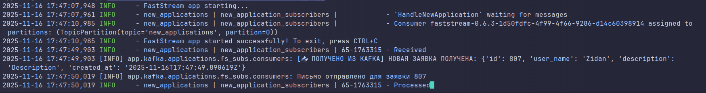
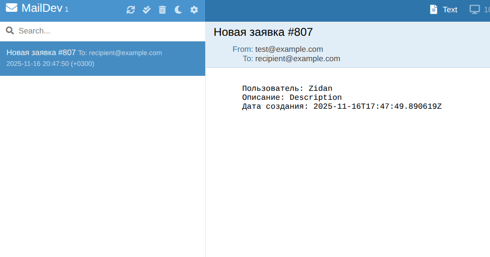

# 📌 Application Service — сервис обработки пользовательских заявок

Микросервис, предназначенный для **создания и получения пользовательских заявок** с публикацией сообщений в **Kafka**.
Построен на основе **FastAPI**, **SQLAlchemy**, **PostgreSQL**, **Kafka**, **FastStream**, **Dishka (DI)**.

---

## 🚀 Стек технологий

| Компонент          | Используется для                 |
| ------------------ | -------------------------------- |
| FastAPI            | REST API                         |
| PostgreSQL         | Хранение заявок                  |
| SQLAlchemy (async) | Асинхронная работа с БД          |
| Kafka + FastStream | Отправка событий о новых заявках |
| Dishka             | Dependency Injection             |
| Pydantic           | Валидация данных и схемы API     |

---

## ⚙️ Настройка окружения

Создайте файл .env и .test.env (для теста) в корне проекта

```env
DB_HOST=localhost
DB_PORT=5432
DB_USER=postgres
DB_PASSWORD=12345
DB_NAME=businesscard

KAFKA_BOOTSTRAP_SERVERS=localhost:9092
KAFKA_TOPIC=new_applications

```

1. Собрать образы и запустить контейнеры

```
docker compose up --build -d
```

2.  Для запуска FastStream

```
docker exec -it applications_web faststream run app.kafka.applications.fs_subs.app:app
```

Делаем заявку и проверяем в Kafka

Если все хорошо, то можно проверить через http://0.0.0.0:1080/ придет ответочное письмо от консюмера


GET /applications?user_name=Ivan&page=1&size=2

```
{
  "items": [
    {
      "id": 1,
      "user_name": "Ivan",
      "description": "Хочу консультацию",
      "created_at": "16-11-2025 16:21:10"
    }
  ],
  "total": 1,
  "page": 1,
  "size": 2,
  "pages": 1
}
```

POST /applications

```
{
  "user_name": "Alex",
  "description": "Нужна помощь с проектом"
}
-------------------
{
  "id": 2,
  "user_name": "Alex",
  "description": "Нужна помощь с проектом",
  "created_at": "16-11-2025 16:24:55"
}

```

GET /applications

```
{
  "items": [
      {
      "id": 1,
      "user_name": "Ivan",
      "description": "Хочу консультацию",
      "created_at": "16-11-2025 16:21:10"
    },
    {
      "id": 2,
      "user_name": "Alex",
      "description": "Нужна помощь с проектом",
      "created_at": "16-11-2025 16:24:55"
},
  ....
  ....
  ....
    {
      "id": 10,
      "user_name": "Fatima",
      "description": "Хочу изменить тариф",
      "created_at": "16-11-2025 09:18:44"
    }
  ],


  "total": 143,
  "page": 1,
  "size": 10,
  "pages": 15
}
```
